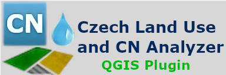

# Documentation of the QGIS Plugin Czech Land Use and CN Analyzer

    

  

## Description

The QGIS plugin enables the automated generation of a Land Cover (Land Use) layer and a Hydrologic Soil Groups layer. After combining these layers, CN value may be assigned and direct runoff heights and volumes me be obtained for design rainfall data provided by [rain.fsv.cvut.cz](https://www.rain.fsv.cvut.cz) or defined by the user.
